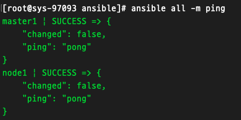

# Install Openshift on RHEL (POWER)
`OS: RedHat Enterprise Linux 7.4 LE`  
`Architect: IBM Power 8`

## 1. Overview
이 문서에서는 POWER기반 RHEL7.4에서 Openshift를 구성하는 것에 대해 기술하겠습니다.

[참고링크: RED HAT Openshift](https://docs.openshift.com/container-platform/3.10/getting_started/install_openshift.html)

## 2. Prerequisites
>메모리 최소 요구량   
>- Master : 16GB  
>- Node : 8GB  

- 이 문서는 POWER기반으로 하고 있습니다.  
>cluster를 구성할 때, POWER기반의 노드는 같은 POWER기반의 노드끼리만 묶일 수 있습니다.  
- 적어도 두개의 노드가 필요!  
- Master와 Node들은 서로 도메인이름으로 통신이 가능해야 합니다. 
 
~~~bash
#현재 서버의 hostname 파악 (Master&Node)
$ hostname 

#hostname 변경 (Master&Node)
$ hostnamectl set-hostname --static {변경할 이름}

#DNS에 등록 (ex)Master)
$ vim etc/hosts

    127.0.0.1   localhost localhost.localdomain localhost4 localhost4.localdomain4
    ::1         localhost localhost.localdomain localhost6 localhost6.localdomain6
    #밑에 추가
    {Master-hostname} {Master-ip}
    {Node1-hostname} {Node1-ip}
~~~
- 또한, 마스터와 노드사이에는 패스워드없이 통신이 가능하도록, ssh key교환을 해야합니다.  
~~~bash
#(모든 서버에서 수행)
#key 생성
$ ssh-keygen

#공개키 배포 
$ for host in 172.29.160.69 \
172.29.160.236; \
do ssh-copy-id -i ~/.ssh/id_rsa.pub $host; \
done

#ping test
$ ping {test할 node}
~~~
ping 테스트까지 마친다면 준비 완료!

## 3. Install
### Add repository
설치에 앞서 Red Hat Openshift 레포지토리를 추가해야합니다.
~~~bash
#redhat id pw등록
$ subscription-manager register   
$ subscription-manager refresh

#Openshift Container Plattform Subscription을 찾아서 추가
$ subscription-manager list —available 
$ subscription-manager attach --pool=<pool_id>  
~~~  

그 다음, 사용할 rpm file들을 enable시킵니다.
~~~bash
#x86기반일 경우 
$ subscription-manager repos --enable="rhel-7-server-rpms" \
    --enable="rhel-7-server-extras-rpms" \
    --enable="rhel-7-server-ose-3.10-rpms" \
    --enable="rhel-7-server-ansible-2.4-rpms"

#Power8일 경우
$ subscription-manager repos \
    --enable="rhel-7-for-power-le-rpms" \
    --enable="rhel-7-for-power-le-extras-rpms" \
    --enable="rhel-7-for-power-le-optional-rpms" \
    --enable="rhel-7-server-ansible-2.6-for-power-le-rpms" \
    --enable="rhel-7-server-for-power-le-rhscl-rpms" \
    --enable="rhel-7-for-power-le-ose-3.10-rpms"

#POWER9일 경우
$ subscription-manager repos \
    --enable="rhel-7-for-power-9-rpms" \
    --enable="rhel-7-for-power-9-extras-rpms" \
    --enable="rhel-7-for-power-9-optional-rpms" \
    --enable="rhel-7-server-ansible-2.6-for-power-9-rpms" \
    --enable="rhel-7-server-for-power-9-rhscl-rpms" \
    --enable="rhel-7-for-power-9-ose-3.10-rpms"
~~~

### Install Package
설치에 필요한 파일들을 인스톨합니다.
~~~bash
$ yum -y install wget git net-tools bind-utils iptables-services bridge-utils bash-completion kexec-tools sos psacct
$ yum -y update
$ reboot

$ yum -y install openshift-ansible
$ yum -y install cri-o
~~~

### Configuring Ansible -inventory
추가적인 에이전트가 필요없는 Ansible은 ssh데몬을 통해 ssh접속이 가능한 곳이라면 제어할 수 있습니다.  
> [ssh key교환](https://github.com/GRuuuuu/rhel-starter/tree/master/Openshift/%2301.%20Install%20Openshift%20on%20RHEL#2-prerequisites)을 반드시 진행해야 합니다.  

Master 노드의 hosts파일을 수정하여 Ansible의 제어대상이 될 노드들의 정보를 입력해 줍니다.  

~~~bash
$ vim /etc/ansible/hosts
~~~
~~~conf
# /etc/ansible/hosts

[OSEv3:children]
masters
nodes
etcd

[OSEv3:vars]
#설치 관리자가 사용할 ssh사용자 설정
ansible_ssh_user=root
openshift_deployment_type=openshift-enterprise

#identity providor설정 (기본값은 deny)
openshift_master_identity_providers=[{'name': 'htpasswd_auth', 'login': 'true', 'challenge': 'true', 'kind': 'HTPasswdPasswordIdentityProvider’}]
openshift_set_node_ip=true

#hostname을 입력했을때 나오는 이름으로 입력해야함
[masters]
sys-97093.dal-ebis.ihost.com

[etcd]
sys-97093.dal-ebis.ihost.com

[nodes]
sys-97093.dal-ebis.ihost.com openshift_node_group_name='node-config-master'

sys-97094.dal-ebis.ihost.com openshift_node_group_name='node-config-compute'
~~~

전부 작성했다면 핑으로 테스트를 해보겠습니다.  
~~~bash
$ ansible all -m ping
~~~
성공했다면 다음과 같은 화면이 뜰것입니다.  

### Configuring Ansible -playbook
호스트 설정을 모두 마쳤다면, 클러스터 구성을 해야합니다.  
inventory_file에는 아까 작성하셨던 hosts파일이 들어가면 됩니다.
~~~bash
$ ansible-playbook -i <inventory_file> /usr/share/ansible/openshift-ansible/playbooks/prerequisites.yml 
$ ansible-playbook -i <inventory_file> /usr/share/ansible/openshift-ansible/playbooks/deploy_cluster.yml 
~~~

