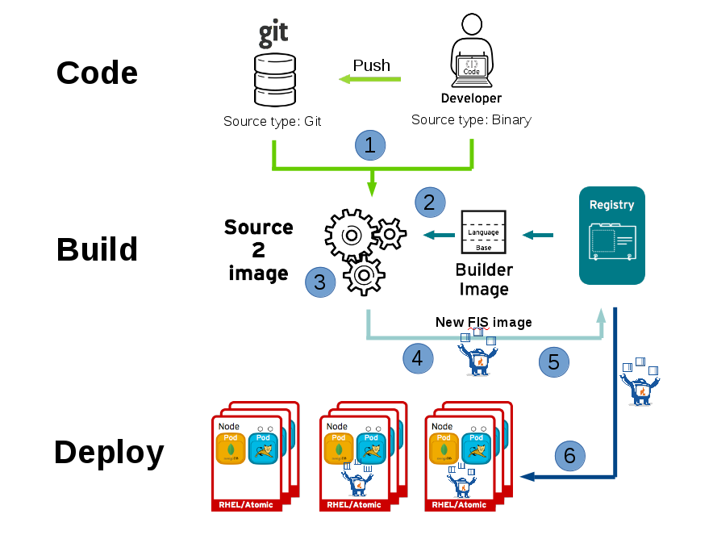
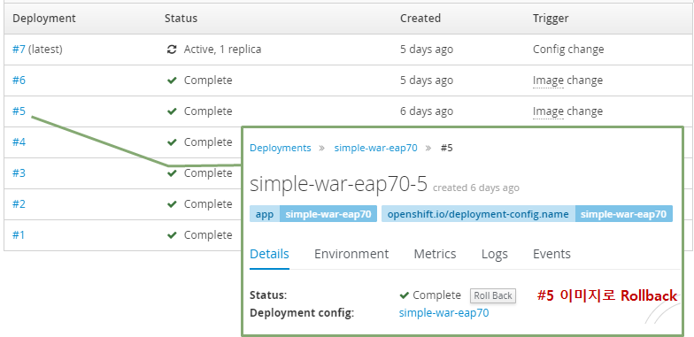
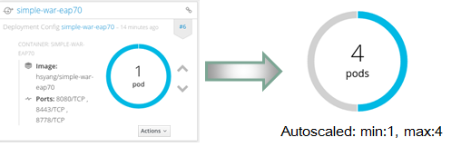
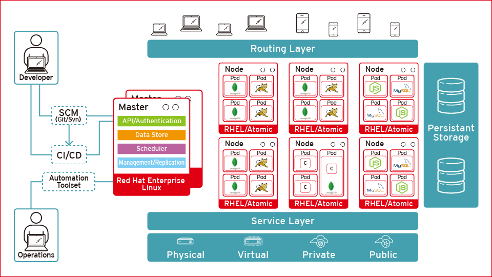

# Red Hat Openshift

  

## Openshift란?
openshift는 기업에 Docker와 Kubernetes를 제공하는 컨테이너 애플리케이션 플랫폼입니다. 사용중인 애플리케이션에 관계없이, 거의 모든 인프라에서 애플리케이션을 쉽고 빠르게 구축, 개발, 배포할 수 있습니다.  
즉, 신속한 애플리케이션 배포를 위해 Docker Container와 DevOps도구를 사용하여 Kubernetes를 지원하는 운영환경을 제공해 줄 수 있습니다.  
>한마디 : 개발 및 운영팀의 역량을 강화하는 데 필요한 <b>아키텍처, 프로세스, 플랫폼</b> 및 <b>서비스</b>를 통합한것

## Openshift의 제공 버전 
### Openshift Origin
- Openshift의 오픈소스 업스트림 프로젝트 
- CentOS와 RHEL에 설치 가능
### Openshift Container Platform 
- RedHat이 제공하고 지원하는 엔터프라이즈 버전
- Openshift에 필요한 자격을 구매하고 전체 인프라의 설치와 관리를 담당 
- 고객이 전체 플랫폼을 소유하기 때문에, on-premise환경이나 퍼블릭 클라우드등에 설치 가능
### Openshift Online
- RedHat의 호스팅형 PaaS
- 클라우드에서 애플리케이션 개발, 구축, 배포, 호스팅 솔루션을 제공 
### Openshift Dedicated
- 클라우드에서 관리형 싱글 테넌트 Openshift환경을 제공
- 클러스터는 RedHat을 통해 관리
- 필요에 따라 추가 리소스 제공
- 타 public cloud에서 클러스터 호스팅 가능

## Openshift 특징
Docker+Kubernetes+DevOps
>- 컨테이너 이미지  
>    - 다양한 미들웨어 및 DB이미지 사용가능
>- DevOps
>   -  Eclipse IDE Plugin을 통한 개발/테스트 지원
>   - Git과 Jenkins를 통한 CI/CD구성 지원
>- App 배포
>   - 빌드 배포 및 자동화 지원
>   - Roll back 방법 제공 
>- 서비스 확장
>   - HA Proxy기반의 Load Balancing 제공 
>   - Auto Scaler를 통한 부하상황에 알맞은 확장 제공
>- 모니터링
>   - 애플리케이션 로그 모니터링 제공 
>   - Pod Cpu, Memory 모니터링 제공
### DevOps
- S2I빌드 및 배포  
    

- Git과 Jenkins를 통한 CI/CD구성 지원  
개발/스테이징에 빌드, 테스트, 배포를 자동화
> CI (Continuous Integration) : 여러명의 개발자가 개발한 소스를 지속적으로 통합하는 것  
> CD (Continuous Delivery) : 빌드 결과물을 지속적으로 전달해서 제품의 질적 향상을 꾀하는 것

- 배포 내역 관리 및 편리한 Rollback

특정 시점으로 롤백!
- Auto-Scaling 기능 제공  
서비스를 수행하는 pod에 부하가 발생하여 cpu사용률이 증가한다면 자동으로 pod을 추가로 생성하여 확장

- 모니터링  

## Openshift Architecture

시스템은 여러 노드들로 구성됩니다. 노드에는 여러개의 pod들이 배치될 수 있으며, pod는 kubernetes가 관리하는 가장 작은 논리 단위이며 여러개의 container들이 배포될 수 있습니다.  
pod는 Master노드에 의해 관리되고(모니터링, 설치, 부하관리, 오류체크), 개발자는 SCM(Source Code Management)의 커밋이벤트로 애플리케이션을 자동으로 이미지로 빌드하여 배포할 수 있습니다.  
사용자는 Routing Layer를 통해 애플리케이션에 접근할 수 있습니다.

----